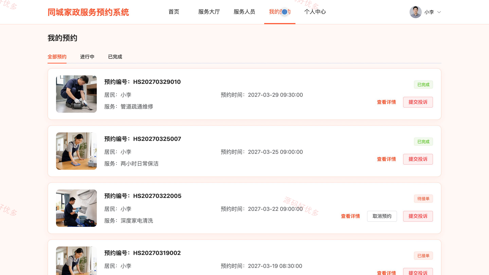
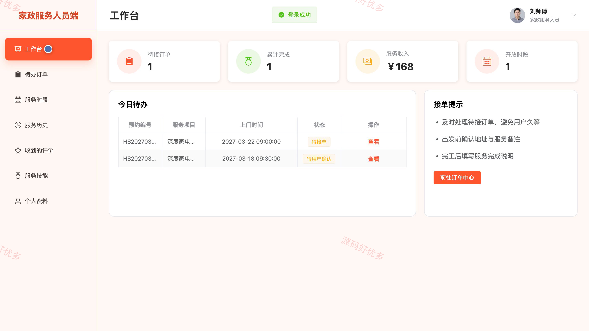
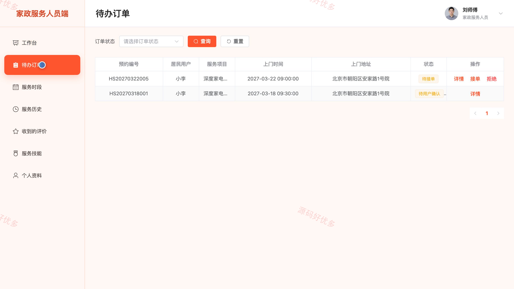
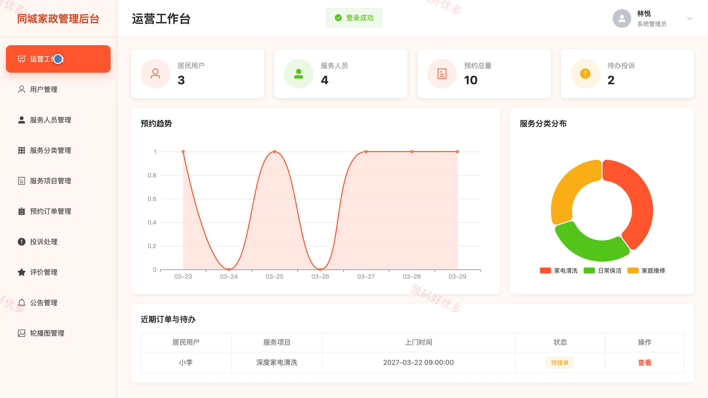
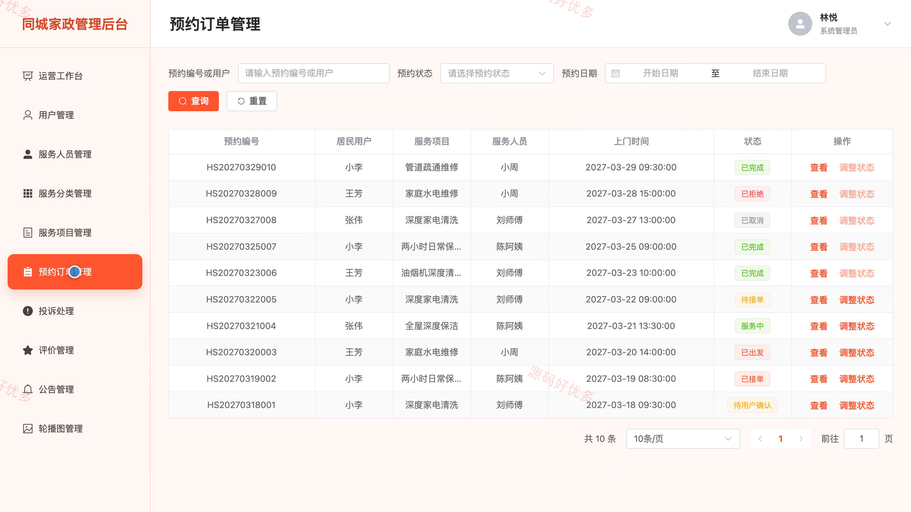

# bs111A
bs111A同城家政服务预约系统
## 源码问题查看主页咨询

### 一、关键词
同城家政、上门服务、保洁预约、家电清洗、家庭维修

### 二、作品包含
源码+数据库+万字设计文档+PPT+全套环境和工具资源+本地部署教程

### 三、项目技术
前端技术： Html、Css、Js、Vue3.4、Element-Plus
后端技术：Java、SpringBoot3.2.0、MyBatis-Plus

### 四、运行环境（以下版本亲测，其他版本兼容性请自行测试）
开发工具：IDEA/eclipse + VSCODE

数据库：MySQL5.7+（共15张表）

数据库管理工具：Navicat10以上版本

环境配置软件： JDK17 + Maven3.6

前端Nodejs：20

浏览器：谷歌浏览器

### 五、项目介绍
项目编号：bs111A

同城家政服务预约系统面向居民用户、家政服务人员和系统管理员，提供家政服务浏览、上门时段预约、服务进度跟踪、完工确认、评价投诉和运营统计等功能，支持预约双方与平台管理端协同处理业务。

角色：居民用户、家政服务人员、系统管理员

居民用户功能：注册登录与个人资料维护、家政服务分类浏览、服务人员与可预约时段查看、上门服务预约提交、预约进度查询与取消、完工结果确认、服务评价与历史查看、投诉反馈与处理结果查看。

家政服务人员功能：登录与个人资料维护、已审核服务技能查看、可预约日期与时段管理、待接预约接单与拒单、出发及服务进度更新、完工说明提交、历史服务记录与评价查看、完成订单与服务金额统计。

系统管理员功能：运营工作台概览、居民用户管理、服务人员审核与技能管理、服务分类与服务项目管理、预约订单查询与异常处理、投诉反馈与服务评价管理、公告与轮播图管理、订单完成率与服务金额统计。

### 六、运行截图

